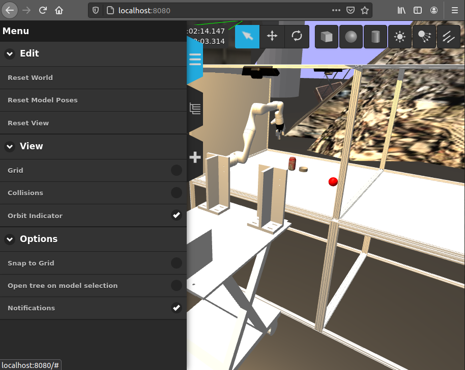

# Glovebox Simulator


## Getting started



The fastest way to get started is using Docker. If you haven't done so already head over to the [Docker website](https://www.docker.com/) and follow the instructions over there. 

Once installed you can simply fire up the pre-built Docker container (it will be downloaded automatically for you):

```
docker login git.ccfe.ac.uk:4567 #if you need to login to gitlab docker repo
docker run -it --name sgs -p 8080:8080 -p 8888:8888 -p 8181:8181 -p 7681:7681 git.ccfe.ac.uk:4567/rain/glovebox/docker-simulator
```

Then connect your local browser to [localhost:8080](http://localhost:8080) to see the simulation and [localhost:8888](http://localhost:8888) to get access to an ipython notebook which you can tinker with. The password for the ipython notebook is `rain`.

## Restarting the container

The next time you want to restart this container you just have to run:

```
docker start sgs
```

And you will be able to connect to [localhost:8080](http://localhost:8080) and [localhost:8888](http://localhost:8888) again.

If on startup you get the following error: 
```
[Err] [RenderEngine.cc:734] Can't open display: :1.0
```
The camera topics will not be published. This error is caused by an erratic closure of the X server processes. In order to fix it run the following command on your host:
```
docker exec -it sgs bash
```
then run:

```
rm /tmp/.X1-lock
```

Finally restart the container.

## Notes

* Note, there is no need to use nvidia-docker as Gazebo server is CPU bound.

* We have added significant wait points in the start up scripts to attempt to ensure a smooth start-up. These plausbly can be reduced or removed. The total time for start up currently is about 2 mins.

* To interact with container with ROS directly run the container with local networking, ie:
```
docker login git.ccfe.ac.uk:4567 #if you need to login to gitlab docker repo
docker run -it --name sgs --network=host git.ccfe.ac.uk:4567/rain/glovebox/docker-simulator
```


## Acknowledgements

The developers would like to sincerely thank Shadow robotics for which created Smart Grasping Sandbox (https://github.com/shadow-robot/smart_grasping_sandbox),
which acted as the direct inspiration for this container.
